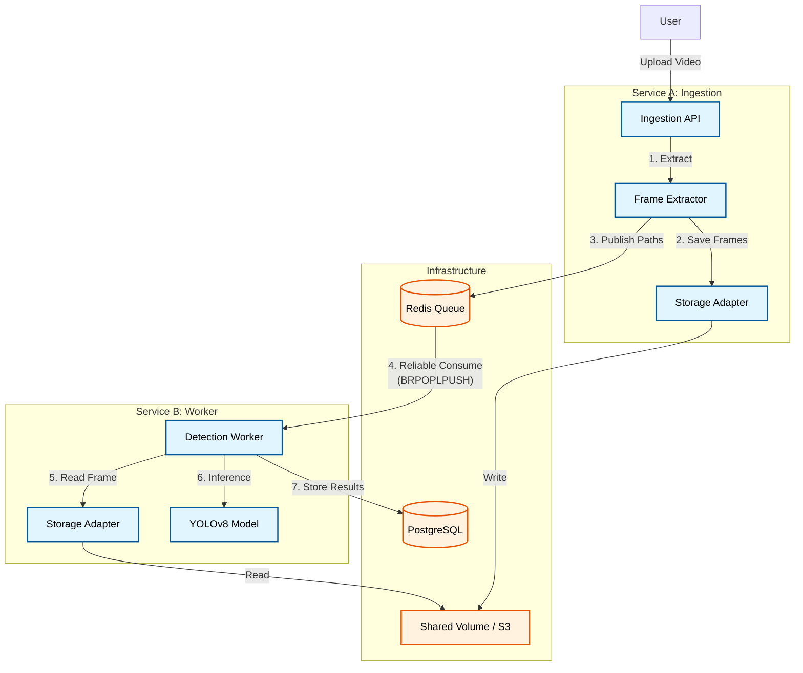

# Architecture Design Document

## 1. System Overview
This system is designed to provide a specific capability: **Video Ingestion and Object Detection**. It accepts video uploads, processes them to extract frames, and runs object detection (YOLOv8) on those frames using an asynchronous, event-driven architecture.

### Key Goals
- **Scalability**: Decoupled ingestion and processing to handle bursts of traffic.
- **Reliability**: ZERO message loss architecture using Redis AOF and Reliable Queue Patterns.
- **Maintainability**: Clear separation of concerns and storage abstractions.

## 2. High-Level Architecture

## 3. Core Components

### Service A: Ingestion Service
- **Role**: Accepts user uploads, performs frame extraction, and handles temporary storage.
- **Tech**: FastAPI (Python), OpenCV/FFmpeg.
- **Data Flow**: `Video -> Frames -> Storage -> Redis Event`

### Service B: Detection Worker
- **Role**: Consumes frame events, runs AI inference, and persists results.
- **Tech**: Python Asyncio, Ultralytics YOLOv8.
- **Data Flow**: `Redis Event -> Read Frame -> Inference -> DB Insert`

### Storage Layer (Abstracted)
- **Concept**: A simple interface (`VideoStorage`) allowing the underlying storage engine to be swapped (e.g., from Local Disk to S3) without changing application logic.
- **Implementation**: Docker Shared Volume (`/data/frames`) for MVP.

## 4. Key Design Decisions

### 4.1 Message Broker: Redis vs. Kafka
We rejected Apache Kafka in favor of **Redis** for this specific use case.

| Feature | Redis (Selected) | Apache Kafka |
| :--- | :--- | :--- |
| **Pattern** | **Work Queue** (Distribute jobs to one of N workers) | **Event Stream** (Replay history to many consumer groups) |
| **Throughput** | High (Internal Memory), limited by single thread (~100k/s) | Massive (Disk Sequential I/O), scales horizontally |
| **Complexity** | Low. Minimal ops. | High. Requires Zookeeper/KRaft, schema registry. |
| **Latency** | Sub-millisecond | Millisecond+ |

**Decision**: We need a Work Queue to distribute extraction jobs, not a persistent event log. Redis is lighter, faster, and sufficiently scalable for our needs. We can switch to Kafka if we need massive fan-out (multiple teams consuming the same video stream) or extensive replay retention.

### 4.2 Database: PostgreSQL vs. MongoDB
We rejected MongoDB in favor of **PostgreSQL**.
- **Reason**: While detection results are JSON, video analytics require structured queries ("How many cars in the last hour?"). Postgres offers superior aggregations, relational integrity, and efficient JSONB querying.

### 4.3 Reliability & Persistence
To ensure **Zero Data Loss**, we employ a two-tiered strategy:

1.  **Broker Safety (Redis AOF)**:
    - We enable **Append Only File (AOF)** persistence in Redis.
    - Every write operation is logged to disk.
    - **Outcome**: If the Redis server crashes and restarts, the queues are reconstructed exactly as they were.

2.  **Worker Safety (Reliable Queue Pattern)**:
    - We use the `BRPOPLPUSH` command.
    - **Mechanism**: Atomically moves a job from `queue:pending` to `queue:processing`.
    - **Outcome**: If a Worker crashes *while* processing a frame, the job is not lost—it remains safely in the `processing` list. A recovery process (or the restarted worker) can reclaim incomplete jobs.

## 5. Scalability Considerations
- **Frames/Second**: The current architecture allows us to scale **Service B** horizontally to increase inference throughput.
- **Bottlenecks**: The single Redis instance is the first bottleneck.
- **Mitigation**:
    - **Level 1**: Redis Sharding (Partition by Video ID).
    - **Level 2**: Move to Redis Streams or Kafka for partitioned consumption.
