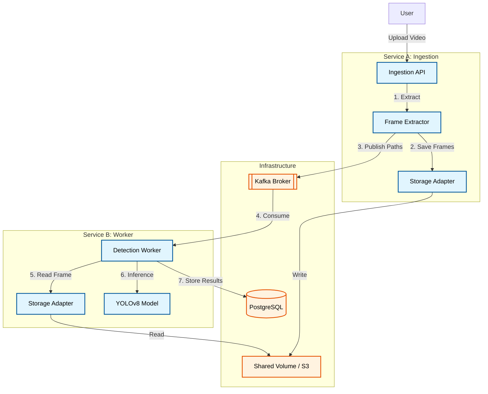

# Architecture Design Document

## 1. System Overview
This system is designed to provide a specific capability: **Video Ingestion and Object Detection**. It accepts video uploads, processes them to extract frames, and runs object detection (YOLOv8) on those frames using an asynchronous, event-driven architecture.

### Key Goals
- **Scalability**: Decoupled ingestion and processing to handle bursts of traffic.
- **Reliability**: ZERO message loss architecture using Redis AOF and Reliable Queue Patterns.
- **Maintainability**: Clear separation of concerns and storage abstractions.

## 2. High-Level Architecture

## 3. Core Components

### Service A: Ingestion Service
- **Role**: Accepts user uploads, performs frame extraction, and handles temporary storage.
- **Tech**: FastAPI (Python), OpenCV/FFmpeg.
- **Data Flow**: `Video -> Frames -> Storage -> Redis Event`

### Service B: Detection Worker
- **Role**: Consumes frame events, runs AI inference, and persists results.
- **Tech**: Python Asyncio, Ultralytics YOLOv8.
- **Data Flow**: `Redis Event -> Read Frame -> Inference -> DB Insert`

### Storage Layer (Abstracted)
- **Concept**: A simple interface (`VideoStorage`) allowing the underlying storage engine to be swapped (e.g., from Local Disk to S3) without changing application logic.
- **Implementation**: Docker Shared Volume (`/data/frames`) for MVP.

## 4. Key Design Decisions

### 4.1 Message Broker: Apache Kafka
We use **Apache Kafka** (KRaft mode) for its superior durability and scaling characteristics compared to simple work queues.

| Feature | Apache Kafka |
| :--- | :--- |
| **Pattern** | **Event Stream** (Distributed partitions with consumer groups) |
| **Throughput** | Massive (Disk Sequential I/O), scales horizontally |
| **Persistence** | Configurable retention periods, replayable logs |
| **Reliability** | Message durability across broker restarts |

**Decision**: Kafka provides the horizontal scaling (via partitions) and fault-tolerance required for large-scale video processing pipelines.

### 4.2 Database: PostgreSQL
We use **PostgreSQL** for structured storage of detection metadata.
- **Reason**: Detection results are stored as JSONB, allowing for flexible schemas while maintaining relational integrity for cross-video analytics.

### 4.3 Reliability & Persistence
1.  **Broker Safety (Kafka)**:
    - Kafka stores messages on disk. We use the **KRaft** architecture to eliminate Zookeeper dependency.
2.  **Worker Safety (Consumer Groups)**:
    - We use manual offset commits. If a worker crashes mid-task, the message is not acknowledged and will be re-delivered.

## 5. Scalability Considerations
- **Horizontal Scaling**: Service B (Worker) can be scaled by adding more containers into the same Kafka consumer group.
- **Partitioning**: Increasing Kafka partitions allows for higher parallel throughput across multiple physical nodes.
