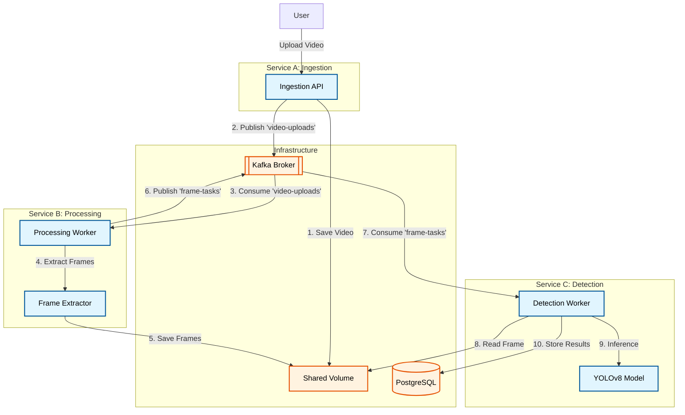

# Architecture Design Document

## 1. System Overview
This system is designed for **Video Ingestion, Processing, and Object Detection**. It uses a staged pipeline approach to decouple slow processing tasks (frame extraction and AI inference) from the fast ingestion task.

### Key Goals
- **Scalability**: Each stage of the pipeline can be scaled independently.
- **Reliability**: Message durability via Kafka and manual offset commits.
- **Responsiveness**: Ingestion returns immediately after the video is saved and task is queued.

## 2. High-Level Architecture

## 3. Core Components

### Service A: Ingestion Service
- **Role**: Entry point for users. Saves the original video file and queues it for processing.
- **Tech**: FastAPI (Python).
- **Data Flow**: `Upload -> Disk -> Kafka (video-uploads)`

### Service B: Processing Service
- **Role**: Consumes uploaded videos, extracts individual frames at a specific interval.
- **Tech**: Python Asyncio, OpenCV.
- **Data Flow**: `Kafka (video-uploads) -> Frame Extraction -> Disk -> Kafka (frame-tasks)`

### Service C: Detection Service
- **Role**: Consumes frame tasks and runs object detection.
- **Tech**: Python Asyncio, Ultralytics YOLOv8.
- **Data Flow**: `Kafka (frame-tasks) -> AI Inference -> PostgreSQL`

## 4. Key Design Decisions

### 4.1 Message Broker: Apache Kafka
We use **Apache Kafka** (KRaft mode) for its superior durability and scaling characteristics.

| Topic | Producer | Consumer | Purpose |
| :--- | :--- | :--- | :--- |
| `video-uploads` | Ingestion | Processing | New videos to be fragmented into frames |
| `frame-tasks` | Processing | Detection | Individual frames to be analyzed by AI |

### 4.2 Storage: Shared Volume
We use a Docker shared volume for storing videos and extracted frames. In a cloud environment, this would be replaced with an S3-compatible object store.

### 4.3 Database: PostgreSQL
Stores structured detection results for querying and visualization.

## 5. Scalability Considerations
- **Independent Scaling**: If frame extraction is slow, we can increase `Processing` replicas. If AI inference is the bottleneck, we scale `Detection`.
- **Kafka Partitions**: Increasing partitions in either topic allows for higher parallel throughput.
